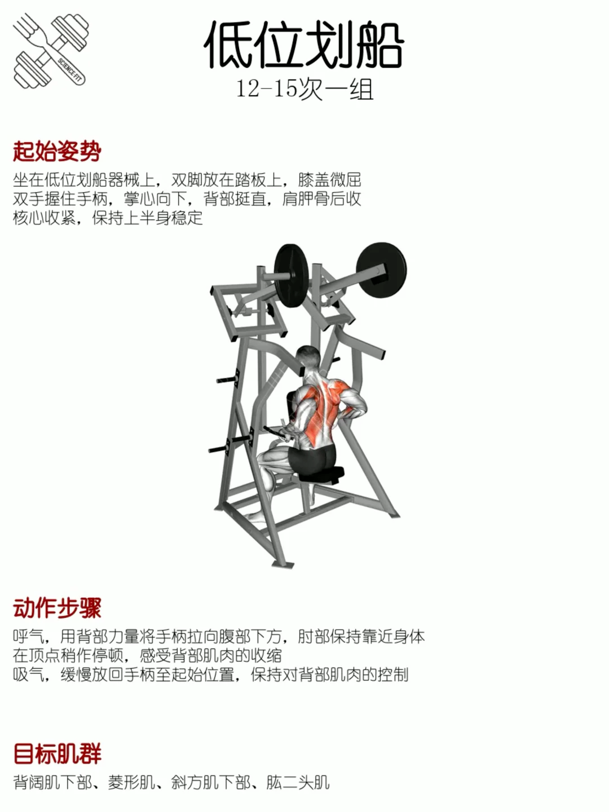

## 肌肉图示

---

# Day 1：背，二头
## 背阔肌：
> [引体向上](https://www.xiaohongshu.com/discovery/item/654246490000000025023b04?source=webshare&xhsshare=pc_web&xsec_token=AB1CUOtsQTvhAzPBV8gFoM7HBdqP9Hb61OYJB2PgCdigk=&xsec_source=pc_share)、[坐姿vbar划船](https://www.xiaohongshu.com/discovery/item/685fbabe000000001001127f?source=webshare&xhsshare=pc_web&xsec_token=ABp5E_2w015A2j9Lo8arAg_pctX4XcURCiKIRnoulilbM=&xsec_source=pc_share)、[高位下拉](https://www.xiaohongshu.com/discovery/item/65d023ef000000000702641f?source=webshare&xhsshare=pc_web&xsec_token=ABy8oQRNk704xg0NFPl1rinb2oZzk1RLhhBwKVIjPIfc8=&xsec_source=pc_share) [高位下拉 2](https://www.xiaohongshu.com/discovery/item/65b7843d000000002c017490?source=webshare&xhsshare=pc_web&xsec_token=ABzNBsZ6KWlYgzgsskk1KSIDBROvBUONnTlSNJ6tAKbYo=&xsec_source=pc_share)、[悍马机划船](https://www.xiaohongshu.com/discovery/item/669ce7bb0000000025000e37?source=webshare&xhsshare=pc_web&xsec_token=ABWKAsTURgVoA8au8rreM-HjKLmMHLDwH0IZ_1J6U90nE=&xsec_source=pc_share)

### 引体向上

### 坐姿 vbar 划船

### 高位下拉
备注：小臂垂直地面，可后仰可不后仰，直杆拉至胸上方下巴下方

### 悍马俯身划船

## 肱二头肌：
> [哑铃弯举](https://www.xiaohongshu.com/discovery/item/660cc0f7000000001a00fa77?source=webshare&xhsshare=pc_web&xsec_token=ABNJrr6YYEEuhXmk5FmRfWMSoMXxAEg_xPocfxeyMAPz4=&xsec_source=pc_share)

### 哑铃弯举

# Day 2：胸，三头
## 胸：
> [跪姿俯卧撑](https://www.xiaohongshu.com/discovery/item/6710f7a3000000001b02f8c9?source=webshare&xhsshare=pc_web&xsec_token=ABL2UVkivG5-TEaTMWi1q3X1ZQtQVKxYbAZQjzdO2RxqA=&xsec_source=pc_share) 
> [哑铃卧推](https://www.xiaohongshu.com/discovery/item/684fd5020000000023013244?source=webshare&xhsshare=pc_web&xsec_token=ABH2NMHY1i37RKgHg0UVjcJIzsBkW1f-Ti0GR3_BvshUY=&xsec_source=pc_share)、[上斜哑铃卧推]( https://www.xiaohongshu.com/discovery/item/673ac1f40000000002038bbf?source=webshare&xhsshare=pc_web&xsec_token=ABRheKWXqlD703vYvV3apS2jasN9t_nXGxPokCq6LXdaI=&xsec_source=pc_share)   
> [把手式蝴蝶机飞鸟 / 蝴蝶机夹胸](https://www.xiaohongshu.com/discovery/item/678d2f4c000000001601b583?source=webshare&xhsshare=pc_web&xsec_token=ABQLHva2WRyYhfBbFVOL29W31t3Rygv9FLsXOV3a8dP00=&xsec_source=pc_share)
> 备选：器械推胸（[直推]( https://www.xiaohongshu.com/discovery/item/68635fd4000000001203098d?source=webshare&xhsshare=pc_web&xsec_token=ABFsQTPjFG4Rw8Xdn79rlRR3FQq5LjhJZ5NYjE1u9vr10=&xsec_source=pc_share)/上斜推）

### 俯卧撑
要点：手掌稍微内旋，大臂与躯干夹角 20°-45°

### 哑铃卧推
要点：[阿键在健身](https://www.xiaohongshu.com/discovery/item/67ab21c1000000001902c256?source=webshare&xhsshare=pc_web&xsec_token=ABbhvXPf8zhl9jWNlOo1bBNf0dTYYDdlzB9IxFiPAdjJ8=&xsec_source=pc_share)

### 上斜哑铃卧推
要点：[阿健在健身](https://www.xiaohongshu.com/discovery/item/67c6bae80000000007036fb7?source=webshare&xhsshare=pc_web&xsec_token=ABwwzknV6F42YaBVpL565T-icTldWdaRt9QEbJUcu41w4=&xsec_source=pc_share)
30°的椅子，大臂和躯干呈锐角，小臂始终垂直地面

### 蝴蝶机夹胸
要点：[阿健在健身](https://www.xiaohongshu.com/discovery/item/66dbae420000000027000b47?source=webshare&xhsshare=pc_web&xsec_token=AB8lATwrwSEj9cBnNMGa_Oqbwl0rrslGMXC3425uds0oc=&xsec_source=pc_share)

### 器械推胸
要点：[阿健在健身](https://www.xiaohongshu.com/discovery/item/6775141b000000000b00f511?source=webshare&xhsshare=pc_web&xsec_token=ABE3eZMOiXlqzyXOUPkvlLTGmxmuJc3hGj3Mju-B5xdJY=&xsec_source=pc_share) 

## 肱三头肌：
>器械臂屈伸，[绳索臂屈伸](https://www.xiaohongshu.com/discovery/item/6866201c000000001d00d0d9?source=webshare&xhsshare=pc_web&xsec_token=ABHZYhTpk-CCWWjCxSFmOI059CTqaz2vJJ5Pl2JnBVt3U=&xsec_source=pc_share)

### 绳索臂屈伸
要点：不要耸肩，拉到最下时小臂稍外旋

# Day 3：腿
> [杠铃深蹲](https://www.xiaohongshu.com/discovery/item/67557115000000000102b433?source=webshare&xhsshare=pc_web&xsec_token=ABw2l6Os9wYqsWRYPB1xis7_yhjWtdtJ20JPc7ZJJTAuE=&xsec_source=pc_share)、 [坐姿腿屈伸](https://www.xiaohongshu.com/discovery/item/6748871900000000060174e2?source=webshare&xhsshare=pc_web&xsec_token=ABwHQkGpJUyytzq-HGN8t3Bf7OINWr2yeCDmRIrej1VxE=&xsec_source=pc_share)、[哑铃保加利亚蹲](https://www.xiaohongshu.com/discovery/item/688d45e90000000023027317?source=webshare&xhsshare=pc_web&xsec_token=ABRn1nPPGtCioSYQ-iRpjIHDJ3h2vOuDnvjLnR0WZd5rw=&xsec_source=pc_share)、[坐姿髋外展](https://www.xiaohongshu.com/discovery/item/6821f09b0000000020028734?source=webshare&xhsshare=pc_web&xsec_token=ABMYtc9GGVzWsGCRkaurT2PJaWFWmyzou7j340fI9k5ck=&xsec_source=pc_share)

### 杠铃深蹲（腿整体）
要点：杠铃初始高度要与腋下齐平。胸椎腰椎都不要弯保持收紧，屈髋。膝盖朝向与脚尖相同，不要内扣。
[阿健在健身](https://www.xiaohongshu.com/discovery/item/66f0a0ce000000002603e97b?source=webshare&xhsshare=pc_web&xsec_token=ABHoZzoYFl7XhU9uukUVRGWHCkiwkOgkYk1v-efq0_eBk=&xsec_source=pc_share) 

### 坐姿腿屈伸（股四）
要点：[阿健在健身](https://www.xiaohongshu.com/discovery/item/670e363b000000001600df2e?source=webshare&xhsshare=pc_web&xsec_token=ABULmyJlE6cdCxWLtc73BtBwl3lmVR3r1cr7HoNypqatk=&xsec_source=pc_share)

### 保加利亚蹲（股四）

### 坐姿髋外展（臀）
[外展+内收，要点](https://www.xiaohongshu.com/discovery/item/6624c25e00000000010040da?source=webshare&xhsshare=pc_web&xsec_token=ABF17jU8poNrciNm69pmzuHbGPHpOkCnwofzVrGGOKFfs=&xsec_source=pc_share) 

# Day 4：肩
>坐姿哑铃推肩、侧平举、哑铃提拉（杠铃直立划船）、蝴蝶机反向飞鸟、绳索面拉
>[集锦：推肩、侧平举、提拉、反向飞鸟]( https://www.xiaohongshu.com/discovery/item/675cd0c4000000000203641b?source=webshare&xhsshare=pc_web&xsec_token=ABfHIFyCGgKnLBsVXsA9WePfITBK2AX5z28VcqYdqPqOk=&xsec_source=pc_share)、[面拉](https://www.xiaohongshu.com/discovery/item/66193540000000001b008904?source=webshare&xhsshare=pc_web&xsec_token=ABycht-SeHHNR30Qhf6KiWePgFgZ906cdzkLvBlmwLH-M=&xsec_source=pc_share)

### 坐姿哑铃推肩

### 侧平举

### 蝴蝶机反向飞鸟

### 面拉

# 腹（随时分配到某天）
>一组 40 s：[平板支撑](https://www.xiaohongshu.com/discovery/item/66e0370a000000000c018e87?source=webshare&xhsshare=pc_web&xsec_token=ABQKKcplq3vNeq9zArDaaDsByXuZ8iJxXthjqm5tl-qCY=&xsec_source=pc_share)、侧卧平板支撑
>一组 20 个：[卷腹](https://www.xiaohongshu.com/discovery/item/67dbe52b000000000d015f8f?source=webshare&xhsshare=pc_web&xsec_token=ABRkPalFE4h4NyhjpDR030rRz2pRHF4y_FFqKejsb2008=&xsec_source=pc_share)、[v 字卷腹](https://www.xiaohongshu.com/discovery/item/666c19df000000000e031547?source=webshare&xhsshare=pc_web&xsec_token=AB7gGhQ1d1nIYdmnmfIBrkPgWcKqpRLu2jamRccPG6RXE=&xsec_source=pc_share)、[侧卧卷腹](https://www.xiaohongshu.com/discovery/item/5e896b02000000000100658d?source=webshare&xhsshare=pc_web&xsec_token=ABJjQ1D15AKbtwAU21Phc9my9c-dA39ZOxINtQtBtUwX4=&xsec_source=pc_share)
>同时练臀的：[侧卧臀桥](https://www.xiaohongshu.com/discovery/item/6405656a000000000800f5fa?source=webshare&xhsshare=pc_web&xsec_token=AB2p8W2Q-ZF5UADShqNaUQ_siht4IBDf3-2sowg8bTjlw=&xsec_source=pc_share)
>器械版：待开发

### 平板支撑

### 卷腹

