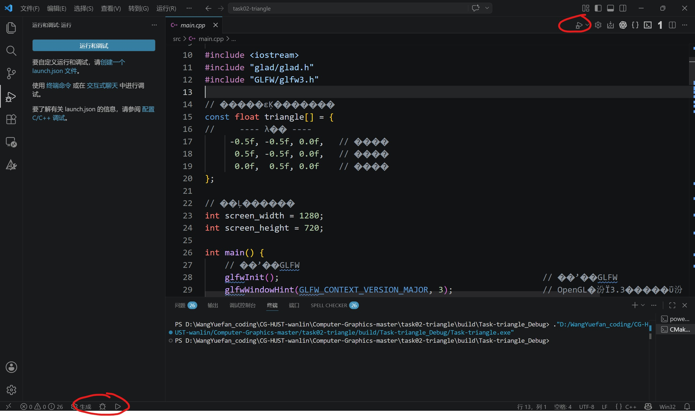

[关于搭环境（C/C++编译器和VSCode的安装、配置）_哔哩哔哩_bilibili](https://www.bilibili.com/video/BV1id4y1n7Kw/?spm_id_from=333.1007.top_right_bar_window_default_collection.content.click&vd_source=9ec10bcc3b93b1166196ae23112e6eb2)

答疑：

左下角的这两个按钮可以正常调试，但右上角的这个按钮点击后却会报图二中的错误

你现在遇到的这个问题，其实是 **VSCode 里两套“调试系统”混在一起用了**，这是很多刚从 Visual Studio 转过来的人都会踩的坑，我给你从最基础讲清楚👇

### ✅ 左下角那一排（你能正常用的）

👉 这是 **CMake Tools 插件提供的调试方式**

它的特点是：

- 自动帮你：
    
    - build（调用 cmake + mingw）
        
    - 运行
        
    - 调试
        
- **不依赖 launch.json / tasks.json**
    
- 一般按钮是：
    
    - “生成”（Build）
        
    - “调试”（Debug）
        

👉 这套是 **推荐你现在用的方式（对新手最友好）**

---

### ❌ 右上角那个按钮（报错的那个）

👉 这是 VSCode 自带的 **标准调试入口（Run and Debug）**

它的特点是：

- 依赖两个配置文件：
    
    - `launch.json`（怎么调试）
        
    - `tasks.json`（怎么编译）
        
- 你现在点击它时，VSCode会：
    
    1. 先执行一个叫：
        
        ```
        C/C++: g++.exe 生成活动文件
        ```
        
        的任务（preLaunchTask）
        
    2. 但这个任务 **失败了 ❌**
        
    3. 所以报错：
        

> 运行 preLaunchTask 出错

---

# 二、为什么会报这个错？（核心原因）

👉 简单说：

**你没有正确配置 VSCode 的“原生调试流程”**

具体可能原因：

### ① 没有 tasks.json

VSCode不知道怎么编译

---

### ② tasks.json 里的 g++ 配置是错的

比如：

- 路径不对（找不到 g++.exe）
    
- 没加库（GLFW / GLAD）
    
- 编译失败
    

# ✅ 推荐方案（强烈建议）

👉 **完全不要用右上角那个按钮！**

只用：

- 左下角：
    
    - 生成
        
    - 调试
        

👉 这是 CMake 官方推荐用法

---

## ✅ 正确调试流程（你现在应该这样用）

1. 打断点 ✅
    
2. 点击：
    
    ```
    左下角 → 小虫子（调试）
    ```
    
3. 程序会：
    
    - 自动 build
        
    - 自动进入断点
        